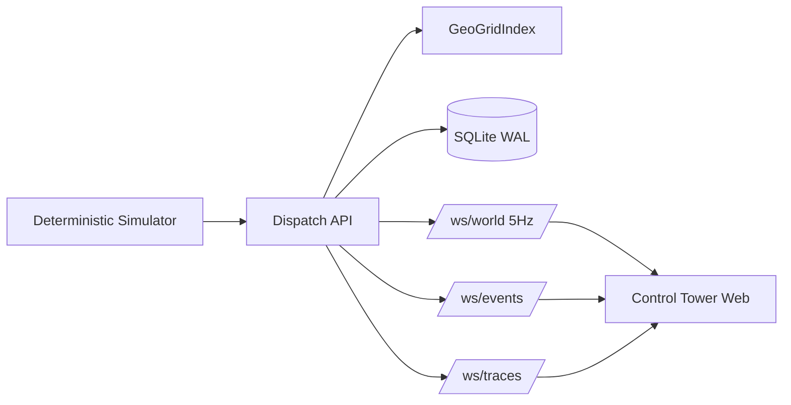

# HyperDispatch Architecture

## Core ideas
- Grid-indexed candidate retrieval (k-ring expansion) to avoid global scans.
- Multi-stage matching pipeline with traces at each stage.
- Replay and diff for deterministic verification of dispatch outcomes.
